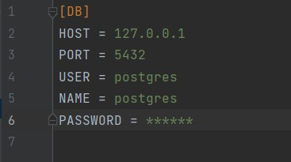
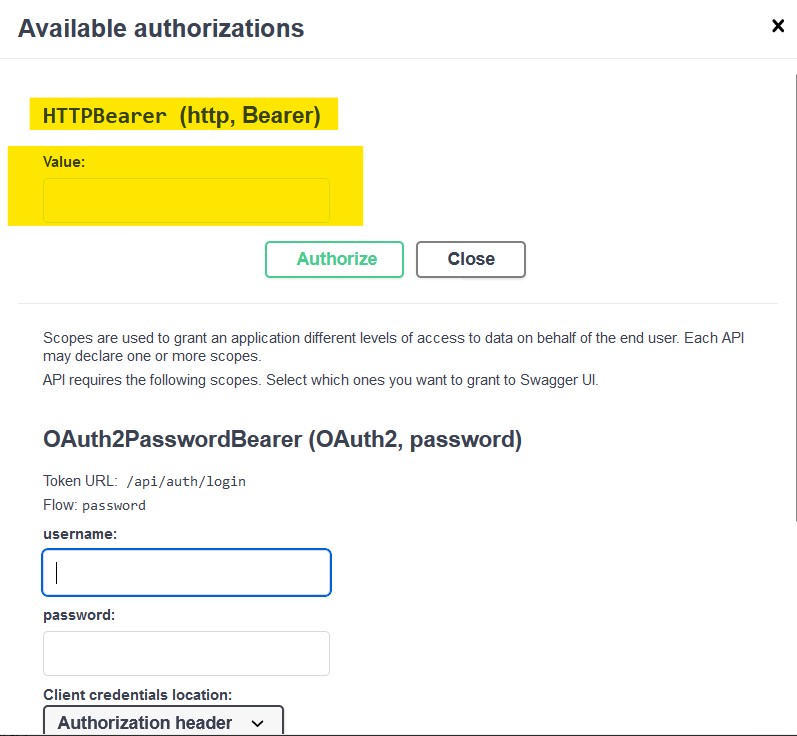
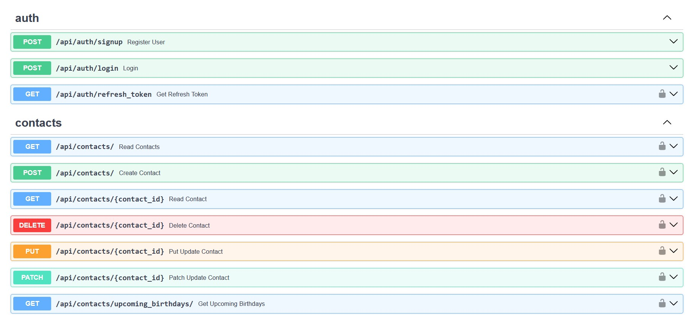

# GoIT_WEB_HW_12
Individual homework №12 at GoIT school

<div>
  <a href="https://www.python.org" target="_blank">
    
  </a>
  &nbsp;&nbsp;&nbsp;&nbsp;
  <a href="https://fastapi.tiangolo.com" target="_blank">
    
  </a>
  &nbsp;&nbsp;&nbsp;&nbsp;
  <a href="https://www.postgresql.org" target="_blank">
    
  </a>
  &nbsp;&nbsp;&nbsp;&nbsp;
  <a href="https://www.sqlalchemy.org" target="_blank">
    
  </a>
  &nbsp;&nbsp;&nbsp;&nbsp;
  <a href="https://www.docker.com" target="_blank">
    
  </a>
</div>


## Description

This is a continuation of [GoIT_WEB_HW_11](https://github.com/S-Stepanov-1/GoIT_WEB_HW_11.git). The project provides a RESTful API for managing your contacts. In this repository, you will find functionalities for creating, retrieving, updating, and deleting contacts, as well as searching for contacts by name, last name, or email address.

This part implements authentication and authorization of new users. Each user can perform certain operations only with his/her own contacts. In addition, in this work attention was paid to security. For secure access a couple of **`JWT tokens`** are used here - **`access_token`** & **`refresh_token`**. access_token is issued for 20 minutes, and refresh_token for 5 days.

## Functionalities

Please see the functionality at this link **[GoIT_WEB_HW_11](https://github.com/S-Stepanov-1/GoIT_WEB_HW_11.git)**.

## Running the Project

To run the project on your computer, follow these steps:

1. Clone the repository:
   ```
   git clone https://github.com/S-Stepanov-1/GoIT_WEB_HW_12.git
   ```

2. Install dependencies:
   ```
   cd GoIT_WEB_HW_12
   poetry install
   ```

3. Create a `config.ini` file in the `GoIT_WEB_HW_12` folder and specify the settings for connecting to the PostgreSQL database:

### config.ini
  

4. Run a Docker container with PostgreSQL database or use analog:
    ```
    docker run --name contacts_postgres -p 5432:5432 -e POSTGRES_PASSWORD=your own password -d postgres
    ```

5. Perform migrations to create tables in the database:
   ```
   alembic upgrade head
   ```

6. Start the server:
   ```
   uvicorn main:app --host localhost --port 8000 --reload  
   ```

You can now access the API by making requests to 
    ```
    http://localhost:8000/docs
    ```
    or
    ```
    http://localhost:8001/redoc
    ```
    
7. Now you need to signup and then to login. After login you will get a couple of tokens. Please use `refresh_token` in this field (see the screen)
### Field for refresh token



## Request Examples

Examples of requests and responses for all the functionalities described above can be found in the [API documentation](http://localhost:8000/docs) after starting the server.
### API


## Conclusion

The **GoIT_WEB_HW_12** project provides a convenient way to manage contacts and their birthdays through a RESTful API. Follow the instructions above to deploy the project on your computer and start using its functionalities. If you have any questions, feel free to reach out to the project author.
